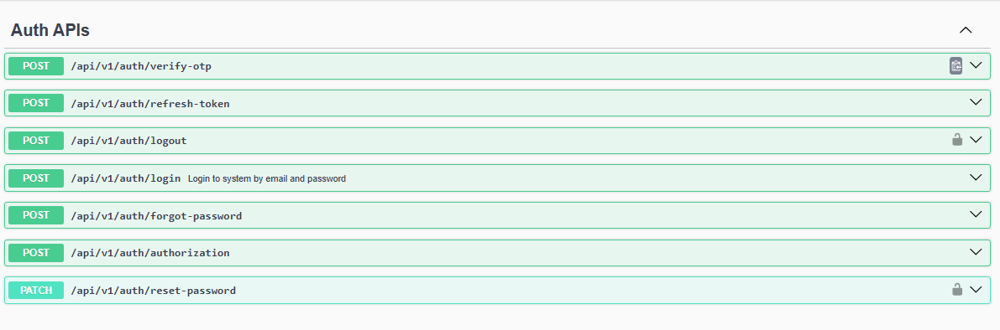
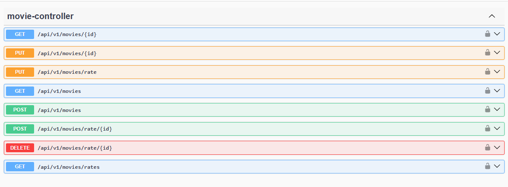
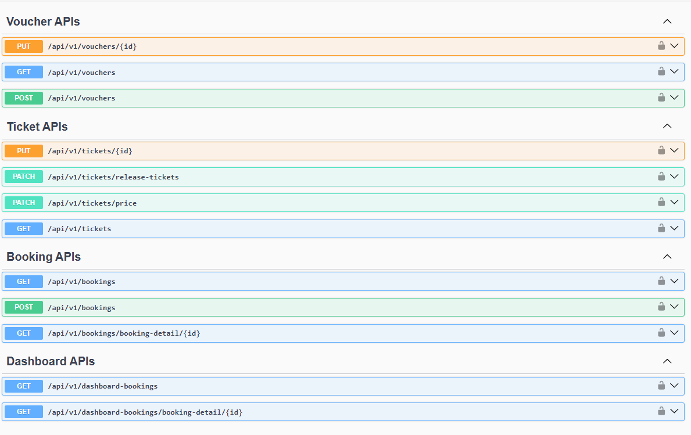
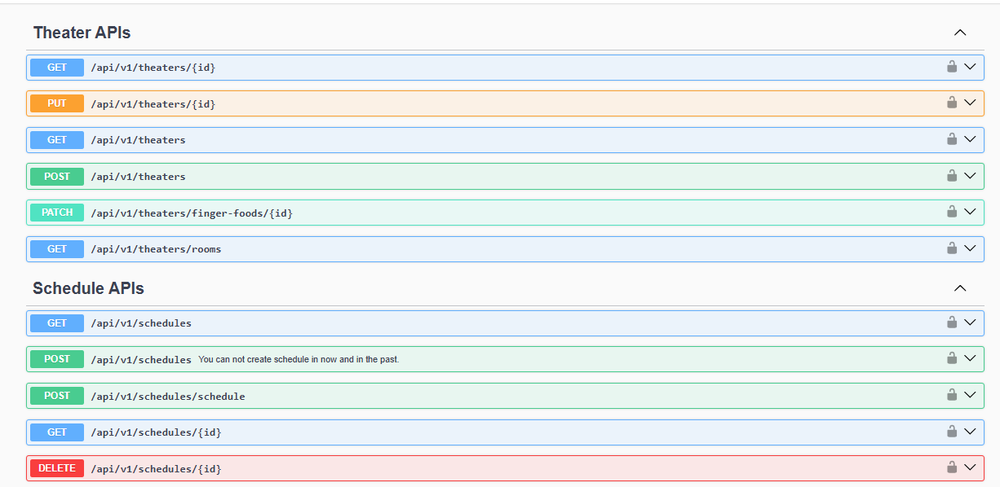
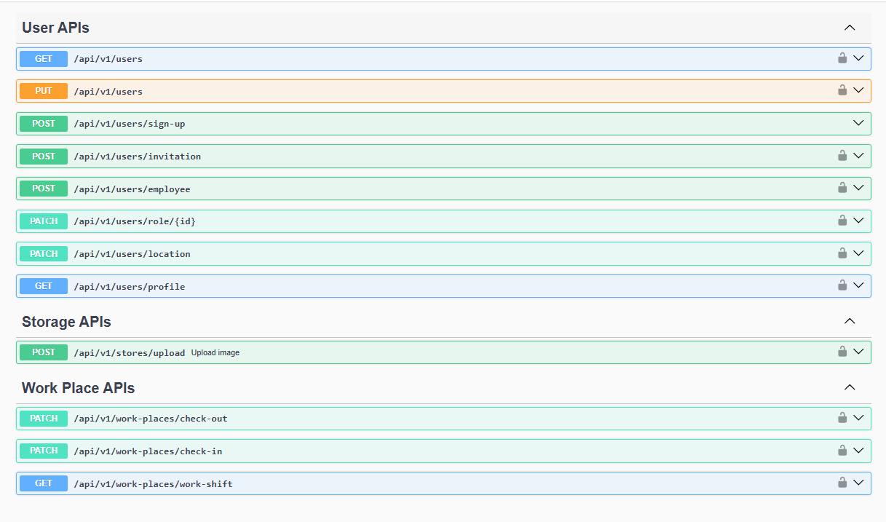

# 🎬 Cinema Management System

Cinema Management System is a comprehensive movie theater management platform built with **Microservices Architecture**.  
It supports movie management, ticket booking, user authentication, payment, scheduling, and more.

All services are registered with **Eureka Server** and exposed through the **API Gateway**.

---
## 🙏 Disclaimer
This project is a **learning project**, built for educational purposes only.  
It may contain mistakes or incomplete features — please kindly excuse any errors.


## 🏗️ System Architecture

- **API Gateway** (Spring Cloud Gateway)
- **Eureka Server** (Service Discovery)
- **Microservices**:
    - `USER-SERVICE` → User Management
    - `IDENTIFICATION-SERVICE` → Authentication & Authorization
    - `MOVIE-SERVICE` → Movie Management
    - `SCHEDULE-SERVICE` → Theater & Schedule Management
    - `BOOKING-SERVICE` → Booking & Ticketing
    - `PAYMENT-SERVICE` → Wallet & Transactions

### 🔧 Technologies
- **Java 21**, **Spring Boot 3**
- **Spring Cloud Netflix** (Eureka, Gateway, Config)
- **PostgreSQL** (Main database)
- **Redis** (Cache / Session store)
- **Kafka** (Event streaming for & payment processing)
- **RabbitMQ** (Message broker for async tasks)
- **Docker & Docker Compose** (Deployment & orchestration)

---

## 📡 Services Overview

| Service                  | Port   | Description            |
|---------------------------|--------|------------------------|
| **API-GATEWAY**           | 9000   | API Gateway            |
| **USER-SERVICE**          | 8082   | User Service           |
| **MOVIE-SERVICE**         | 8083   | Movie Service          |
| **SCHEDULE-SERVICE**      | 8084   | Schedule Service       |
| **BOOKING-SERVICE**       | 8085   | Booking Service        |
| **PAYMENT-SERVICE**       | 8086   | Payment Service        |
| **IDENTIFICATION-SERVICE**| 8087   | Authentication Service |

> ✅ All services are accessed through the **API Gateway (port 9000)**.  
> ✅ Swagger UI is centralized at:  
> http://localhost:9090/booking-service/swagger-ui/index.html?urls.primaryName=payment-service

---

## 🔐 Authentication APIs
- `POST /api/v1/auth/login` → Login with email & password
- `POST /api/v1/auth/verify-otp` → Verify OTP
- `POST /api/v1/auth/refresh-token` → Refresh JWT token
- `POST /api/v1/auth/logout` → Logout
- `POST /api/v1/auth/forgot-password` → Forgot password
- `PATCH /api/v1/auth/reset-password` → Reset password

---

## 🎞️ Movie APIs
- `GET /api/v1/movies` → Fetch all movies
- `GET /api/v1/movies/{id}` → Get movie by ID
- `POST /api/v1/movies` → Create new movie
- `PUT /api/v1/movies/{id}` → Update movie
- `POST /api/v1/movies/rate/{id}` → Rate a movie
- `GET /api/v1/movies/rates` → List all ratings

---

## 🎟️ Booking & Ticket APIs
- `GET /api/v1/tickets` → List tickets
- `POST /api/v1/bookings` → Create a new booking
- `GET /api/v1/bookings/booking-detail/{id}` → Booking details

---

## 🏢 Theater & Schedule APIs
- `GET /api/v1/theaters` → List theaters
- `POST /api/v1/theaters` → Create new theater
- `GET /api/v1/schedules` → List schedules
- `POST /api/v1/schedules` → Create a schedule

---

## 👤 User APIs
- `GET /api/v1/users` → List all users
- `POST /api/v1/users/sign-up` → Register new user
- `GET /api/v1/users/profile` → Get user profile

---

## 💰 Wallet & Transaction APIs
- `GET /api/v1/wallets` → List wallets
- `POST /api/v1/transactions` → Create transaction
- `GET /api/v1/transactions/analysis-time-range` → Transaction analytics

---

## 📸 Swagger UI

> All APIs are documented in a single Swagger UI through the API Gateway:  
> [http://localhost:9090/booking-service/swagger-ui/index.html?urls.primaryName=payment-service]

Screenshots (examples):
- Identification service
  
- Movie service
  
- Booking service
  
- Payment service

- Schedule service
 
- User service
  

---

## 🚀 How to Run

### 1. Requirements
- Docker & Docker Compose
- JDK 21
- Maven

### 2. Run services
```bash
# build all services
mvn clean package -DskipTests

# start with docker compose
docker-compose up -d
